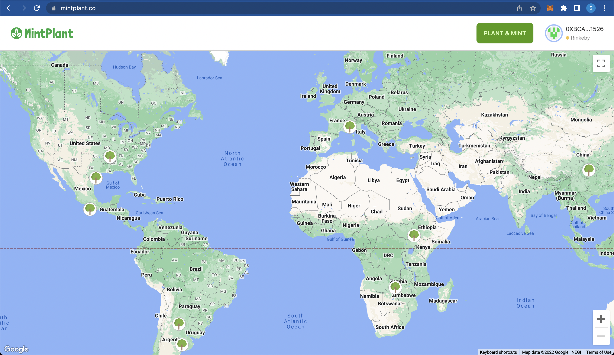
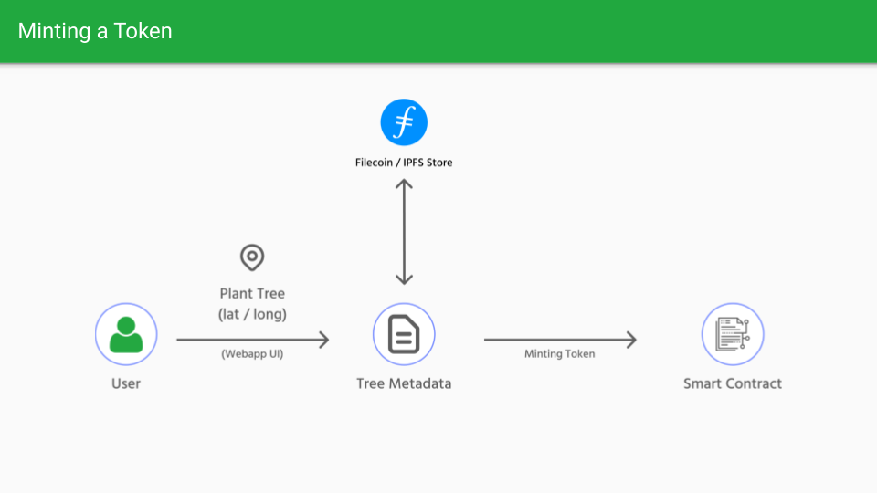
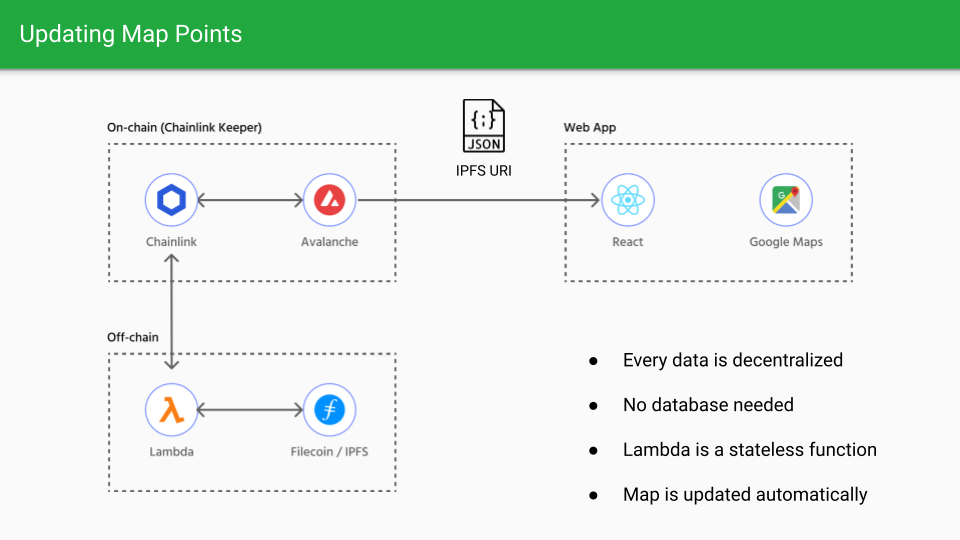

  

# MintPlant

## Table of Contents
1. [About](#about)
2. [Quick Links](#quick-links)
3. [Stack](#stack)
5. [Development](#development)


--------

## Quick Links
- [📹 Video Presentation](https://www.youtube.com/watch?v=W--zBGv1oq0)
- [📕 Techinical Overview](https://TODO)
- [📄 Smart Contract](https://rinkeby.etherscan.io/address/0xB67bD62a7a3d8ec443388ba03b58aA475954ec82)
- [⚡️ Live Demo](https://mintplant.co)
--------

## About

MintPlant is a project where anyone can plant a tree and generate an NFT that represents that tree with its location (latitude/longitude), photo, and species details. The platform will also have a map that shows the impact generated by the community around the world. This map is refreshed automatically when a new token is minted using Chainlink Keeper (Custom Logic) to call an external lambda that updates the map markers points, and store it on IPFS and returns an URI that is stored on-chain.









## Stack

- Webapp: ReactJS + Typescript
- Filecoin + IPFS
- Chainlink Keeper (Custom Logic)
- Lambda: NodeJS
- Google Maps


## Development


### Contract

To deploy a smart contract on testnet, follow the instructions below:


1 - Go to contract folder, and install the dependencies:

```
npm install
```

2 - Setup a .env with env vars:

```
ETHERSCAN_API_KEY=
PRIVATE_KEY=
RINKEBY_URL=
```

3 - Deploy it on testnet:

```
npm run deploy:testnet
```

### Webapp

To run the webapp in development mode, follow the instructions below:

1 - Go to webapp folder and install the dependencies:

```
npm install
```

2 - Set the .env environment variables:

```
REACT_APP_WEB3_STORAGE_TOKEN=
REACT_APP_GOOGLE_MAPS_API_KEY=
REACT_APP_CONTRACT_ADDRESS=
REACT_APP_RINKEBY_RPC_URL=
```

> Note: Use the contract address you created

3 - Run the development mode:

```
npm run start
```

### Lambda

You can deploy the lambda on AWS by generating the deploy.zip file:

1 - Go to the lambda folder

2 - Install the dependencies

```
npm install
```

3 - Run build

```
npm run build
```

> Use this deploy.zip file to upload it to a lamda on AWS

If you want to test a lambda locally you can run:

```
npm run dev
```

This command will run an local express server which you can use to trigger the function. Since you are running on local, the Chainlink API call will not work, so you might want to use a ngrok to solve this.


### Configuring the Chainlink Keeper

1 - Go to [Chainlink Kepper page](https://keepers.chain.link/?_ga=2.72706134.418852019.1657682825-270153475.1657682825)

2 - Follow the [official Chainlink custom logic setup instructions](https://docs.chain.link/docs/chainlink-keepers/introduction/#custom-logic-trigger)

> Note: You should fund your keeper with some LINKs and also the smart contract since it uses the Chainlink API calls that requires LINK.
